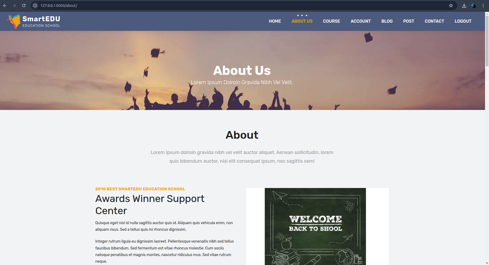
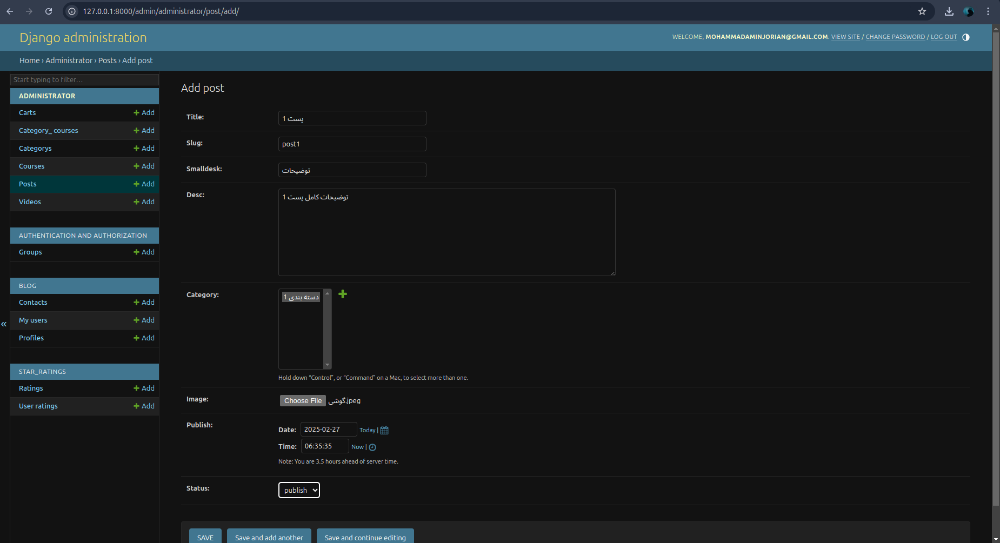
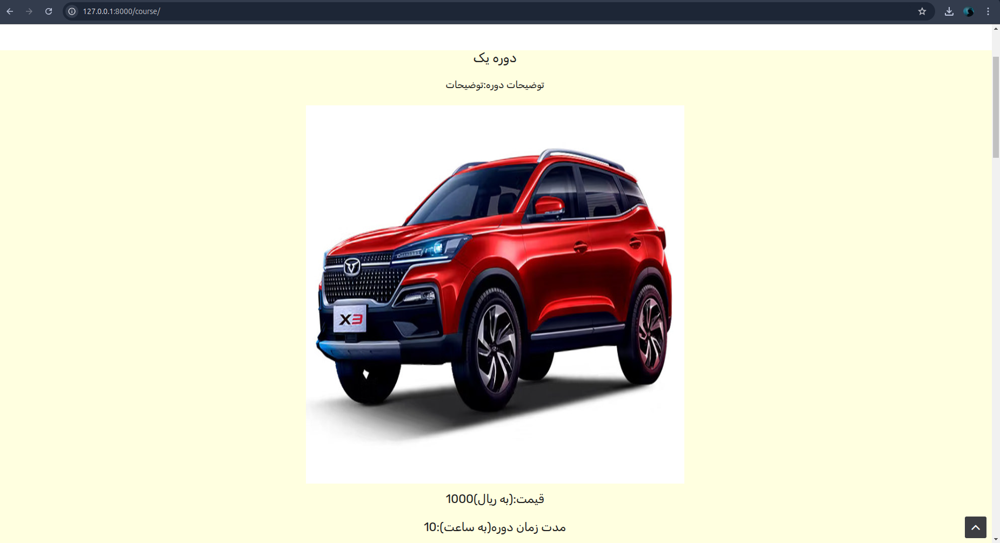
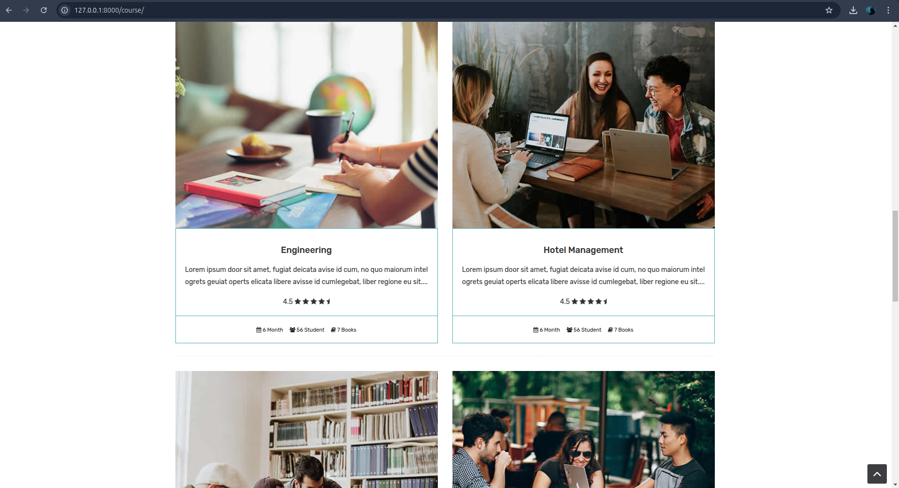
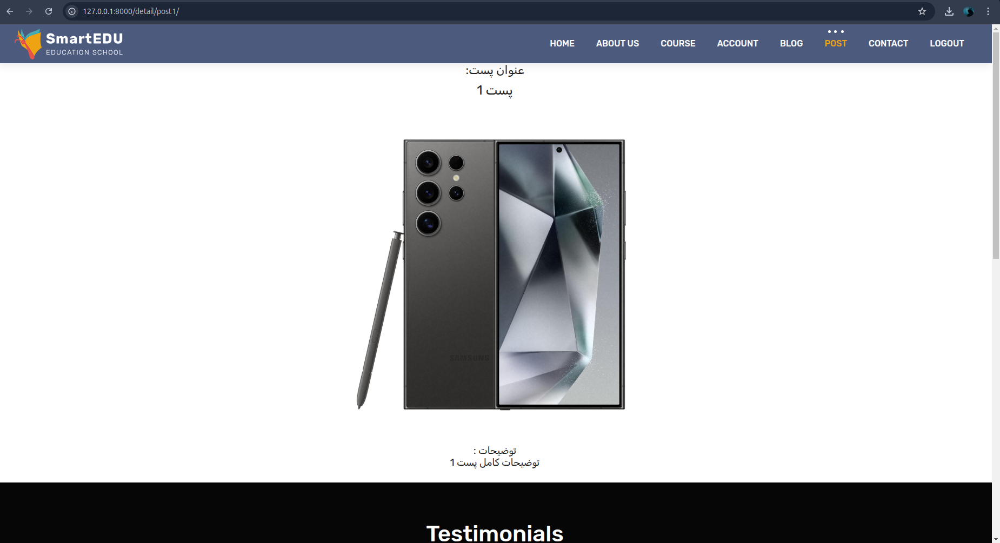

# System of buying and selling virtual courses

It has a special purchase system for the virtual course

## How to run

1. Install python3, pip, virtualenv in your system.
2. Clone the project https://github.com/MohammadAminJorian/sell_course.
3. Make development environment ready and run project using commands below;
git clone https://github.com/MohammadAminJorian/sell_course && cd sell_course
python venv  env  # Create virtualenv named env
source env/bin/activate
pip install -r requirements.txt
mv  sell_course/settings.py sell_course/settings.py
python manage.py migrate  # Create database tables  
python manage.py runserver

1. Has has online purchase system
2. Has has an online course sales system
3. With approval number 
4. Has a posting system 
and ...

 
 

# سامانه خرید و فروش دوره های مجازی

دارای سیستم خرید ویژه دوره مجازی

## اجرای کد

1. را در سیستم خود نصب کنید python3, pip, virtualenv 
2. پروژه را کلون کنید https://github.com/MohammadAminJorian/sell_course.
3. محیط توسعه و پروژه را با استفاده از دستورات زیر آماده کنید. 
git clone https://github.com/MohammadAminJorian/sell_course && cd sell_course
python -m venv env # ایجاد کنید env را با نام  virtualenv 
اجرای محیط توسعه env/bin/activate 
pip install -r requires.txt 
sell_course/settings.py sell_course/settings.py  
python manager.py migrate # جداول پایگاه داده ایجاد کنید 
python manager.py runserver  

1 .دارای سیستم خرید دوره آنلابن 
2 .دارای سیستم فروشش دوره آنلاین 
3 .دارای تایید شماره 
4 . دارای سیستم پست گذاری 
و...

 

 

 

 

 

 

 

