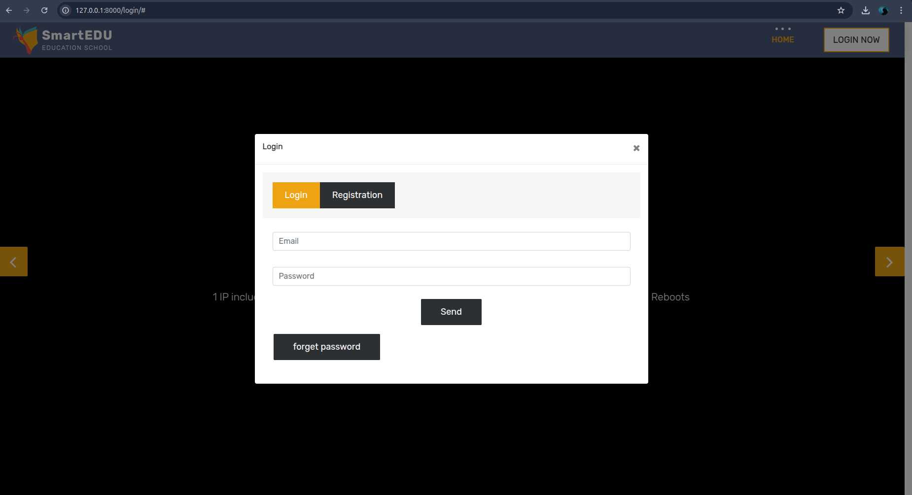
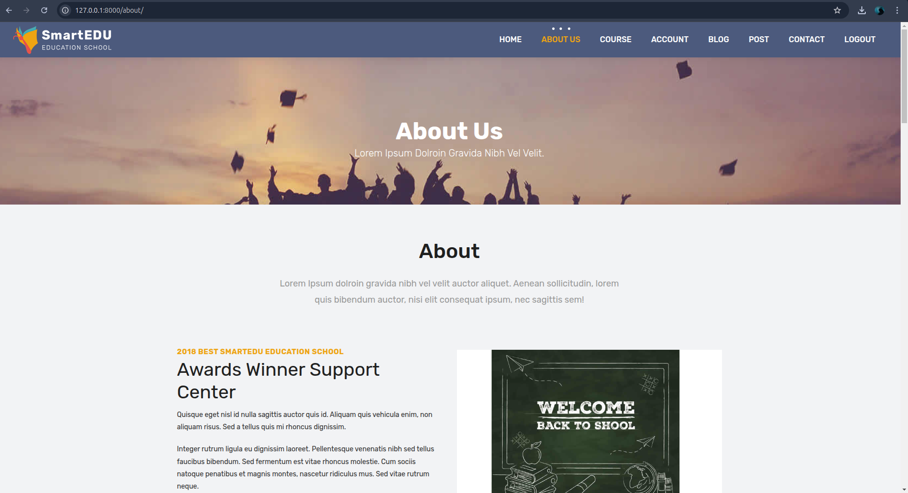
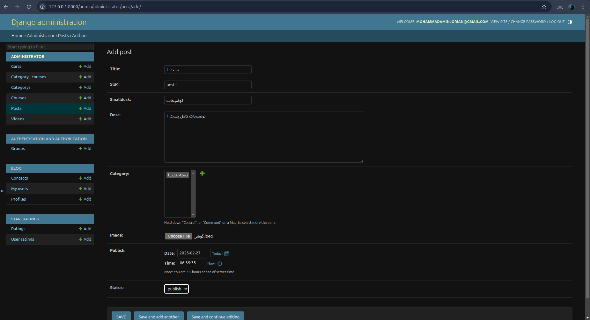
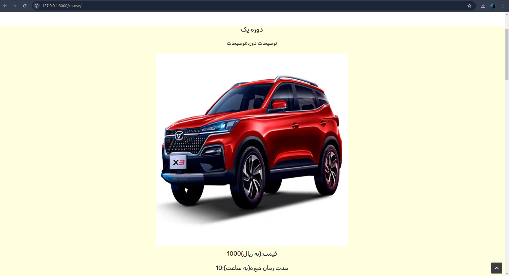
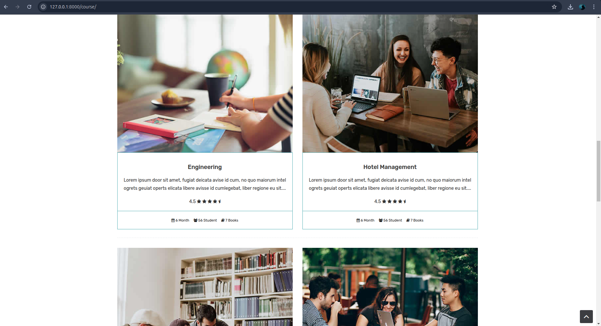
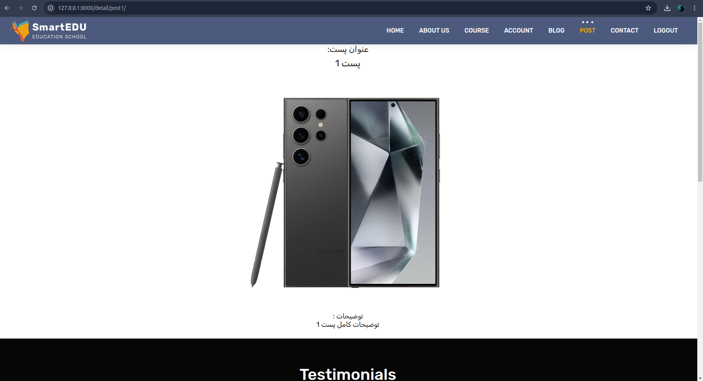

# 🎓 Online Course Marketplace

<p align="center">
  <strong>A Django-based platform for buying and selling online courses</strong>
</p>

<p align="center">
  Online Course Sales • Online Purchase • Phone Verification • Posts
</p>

<p align="center">
  <a href="https://github.com/MohammadAminJorian/sell_course">
    
  </a>
  
  
</p>

---

## 🌟 About The Project

**Online Course Marketplace** is a Django web application designed for selling and purchasing virtual courses online.

The project implements a complete course purchasing workflow along with user phone verification and a posting system.

This project also has a special place in my development journey because it was **my first Django project**, where I started building real-world web applications with Django.

---

## ✨ Features

<table>
<tr>
<td width="50%">

### 🎓 Course System

* Online course sales
* Course purchasing
* Course management
* Dedicated purchase workflow

</td>

<td width="50%">

### 💳 Purchase System

* Online purchasing
* Purchase management
* Course purchase workflow
* User purchase records

</td>
</tr>

<tr>
<td width="50%">

### 👤 User System

* User management
* Phone number verification
* User-related functionality

</td>

<td width="50%">

### 📝 Post System

* Creating posts
* Publishing content
* Post management

</td>
</tr>
</table>

---

## 🛠️ Tech Stack

<p align="center">


</p>

---

# 📸 Screenshots

## 🏠 Application Interface

<p align="center">
  
</p>

---

## 🎓 Course System

<p align="center">
  
</p>

---

## 🛒 Purchase System

<p align="center">
  
</p>

---

## 👤 User System

<p align="center">
  
</p>

---

## 📝 Post System

<p align="center">
  
</p>

---

## 💻 Additional Views

<p align="center">
  
</p>

<p align="center">
  
</p>

---

# 🚀 Getting Started

Follow the steps below to run the project locally.

### 1️⃣ Clone the repository

```bash
git clone https://github.com/MohammadAminJorian/sell_course.git
cd sell_course
```

### 2️⃣ Create a virtual environment

```bash
python -m venv env
```

### 3️⃣ Activate the environment

#### Windows

```bash
env\Scripts\activate
```

#### Linux / macOS

```bash
source env/bin/activate
```

### 4️⃣ Install dependencies

```bash
pip install -r requirements.txt
```

### 5️⃣ Apply database migrations

```bash
python manage.py migrate
```

### 6️⃣ Create an administrator account

```bash
python manage.py createsuperuser
```

### 7️⃣ Run the development server

```bash
python manage.py runserver
```

Open the project in your browser:

```text
http://127.0.0.1:8000/
```

---

# 📂 Project Structure

```text
sell_course/
│
├── sell_course/
│   ├── settings.py
│   ├── urls.py
│   └── ...
│
├── ...
│
├── manage.py
├── requirements.txt
├── README.md
│
├── img_1.png
├── img_2.png
├── img_3.png
├── img_4.png
├── img_5.png
├── img_6.png
└── img_7.png
```

---

# 🧠 Project Highlights

### 🎓 Online Course Marketplace

The main purpose of the project is to provide a platform where users can discover and purchase virtual courses.

### 🛒 Online Purchase

The project includes a dedicated purchasing workflow for online courses.

### 📱 Phone Verification

Users can verify their phone number as part of the authentication/user workflow.

### 📝 Publishing System

A post system is included for publishing and managing content.

---

# 📚 My First Django Project

This project is an important milestone in my development journey.

It was my **first Django project** and one of the projects where I started applying Django concepts to a real-world application.

Building this project helped me learn and practice:

* Django project structure
* Models and databases
* Views
* Templates
* URL routing
* Forms
* Authentication
* CRUD operations
* Database migrations
* User workflows
* Building web applications with Python

---

# 🔮 Future Improvements

Possible improvements for the project include:

* 💳 Advanced payment gateway integration
* 📧 Email notifications
* 📱 SMS notifications
* 🎥 Course video management
* ⭐ Course ratings and reviews
* 🔍 Advanced course search
* 🛒 Shopping cart
* 📊 Instructor dashboard
* 📈 Sales analytics
* 🔐 Advanced permissions and roles

---

# 👨‍💻 Developer

<p align="center">

<strong>Mohammad Amin Jorian</strong>

<br><br>

<a href="https://github.com/MohammadAminJorian">
  
</a>

<a href="https://mohammadaminjorian.github.io/Portfolio/">
  
</a>

</p>

---

## ⭐ Support

If you found this project interesting, consider giving it a ⭐ on GitHub.

---

<p align="center">
  Made with ❤️ using Python & Django
</p>
